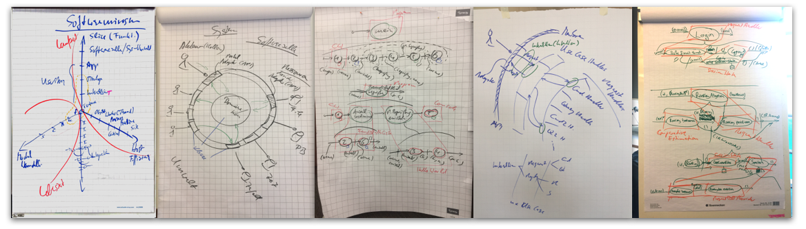

Flow-Design ist eine **leichtgewichtige Methode zur Softwareentwicklung** von der Anforderungsanalyse bis zur Abnahme durch den Kunden.

Ziel von Flow-Design ist eine **nachhaltige Softwareentwicklung**, d.h. eine, die heute erfolgreich ist *und* auch in Zukunft.

Zu diesem Zweck versammelt Flow-Design Prinzipien, Praktiken, Konzepte unter anderem aus dem Clean Code Development, der Agilität, dem Software Engineering oder auch der Lean Production. **Flow-Design ist ganz pragmatisch: benutzt wird, was hilfreich ist.**

Das spiegelt sich auch in der Spuren, die es hinterlässt. Der kreative Prozess soll nicht durch Formalismen behindert werden.

{:width="90%" height="90%" align="center"}

Grobe Pinselstriche auf dem Weg zum Code; **im Code dann absoluter Blick fürs Detail.**

Begründet wird die Sammlung von Prinzipien, Praktiken und Konzepten durch Argumente, die aus grundlegenden Beobachtungen abgeleitet sind.

**Flow-Design richtet sich an den Praktiker, der Software im Team ökonomisch für den Kunden produzieren will**. Ihm bietet Flow-Design sowohl Heuristiken wie handfeste Methoden, Empfehlungen für die Codierung wie visuelle Notation für die Kommunikation im Team.

Flow-Design ist sich der fundamentalen Komplexität der Softwareentwicklung bewusst. Eine Silberkugel wird nicht angeboten. Dennoch: **Flow-Design ist bemüht, unnötige Komplexität mit klaren Empfehlungen aus dem Weg zu räumen.**

Die Leitsätze des Flow-Design entstammen dem [Elastischen Manifest](http://geekswithblogs.net/theArchitectsNapkin/archive/2011/12/16/from-agile-to-elastic.aspx):

* Acceptance over specification
* Progress over completion
* Reactivity over commitment

Flow-Design hat seine Wurzeln unter anderem in der Agilität, geht jedoch darüber hinaus. **In Flow-Design fließen Vorgehensmodell und Programmierpraxis zusammen.**

Mit dem Wiki von flow-design.org möchte die [Clean Code Developer School](http://ccd-school.de) nun den Ort schaffen, an dem Flow-Design zumindest grundlegend und knapp dokumentiert ist.

[Zum Wiki...](https://github.com/ccdschool/flow-design-org/wiki)
